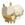

# Villager List & Camper cards

If you're collecting stickers or just want certain villagers to show up in whistle pass, you can use the links to get QR codes with those villagers.

_Note: if you're trying to import multiple cards with the same partner, click the "+" button beside PlayerId before you import again. This will keep the player ID unique._

Data Sources: [Nookipedia](https://nookipedia.com/wiki/Villager/Pocket_Camp), [Animal Crossing Wiki](<https://animalcrossing.fandom.com/wiki/Villager_list_(Pocket_Camp)>)

| Villager   | Picture                                                   | PartnerId | Theme                                           | Resource                           | Camper Card                                                                  |
| ---------- | --------------------------------------------------------- | --------- | ----------------------------------------------- | ---------------------------------- | ---------------------------------------------------------------------------- |
| Cyrano     |         | 200100    |  |          | [Generate](https://jeremy-friesen.github.io/acpc-qr-editor?PartnerId=200100) |
| Antonio    |        | 200200    |          |          | [Generate](https://jeremy-friesen.github.io/acpc-qr-editor?PartnerId=200200) |
| Pango      |           | 200300    |          |          | [Generate](https://jeremy-friesen.github.io/acpc-qr-editor?PartnerId=200300) |
| Anabelle   |     | 200400    |  |          | [Generate](https://jeremy-friesen.github.io/acpc-qr-editor?PartnerId=200400) |
| Annalisa   |     | 200500    |  |          | [Generate](https://jeremy-friesen.github.io/acpc-qr-editor?PartnerId=200500) |
| Olaf       |              | 200600    |            |          | [Generate](https://jeremy-friesen.github.io/acpc-qr-editor?PartnerId=200600) |
| Teddy      |           | 200700    |        |          | [Generate](https://jeremy-friesen.github.io/acpc-qr-editor?PartnerId=200700) |
| Pinky      |           | 200800    |  |          | [Generate](https://jeremy-friesen.github.io/acpc-qr-editor?PartnerId=200800) |
| Curt       |             | 200900    |  |          | [Generate](https://jeremy-friesen.github.io/acpc-qr-editor?PartnerId=200900) |
| Chow       |              | 201000    |                |          | [Generate](https://jeremy-friesen.github.io/acpc-qr-editor?PartnerId=201000) |
| Nate       |             | 201100    |          |          | [Generate](https://jeremy-friesen.github.io/acpc-qr-editor?PartnerId=201100) |
| Groucho    |       | 201200    |              |          | [Generate](https://jeremy-friesen.github.io/acpc-qr-editor?PartnerId=201200) |
| Tutu       |             | 201300    |              |          | [Generate](https://jeremy-friesen.github.io/acpc-qr-editor?PartnerId=201300) |
| Grizzly    |       | 201400    |        |          | [Generate](https://jeremy-friesen.github.io/acpc-qr-editor?PartnerId=201400) |
| Paula      |            | 201500    |                |          | [Generate](https://jeremy-friesen.github.io/acpc-qr-editor?PartnerId=201500) |
| Charlise   |     | 201600    |          |          | [Generate](https://jeremy-friesen.github.io/acpc-qr-editor?PartnerId=201600) |
| Beardo     |         | 201700    |  |          | [Generate](https://jeremy-friesen.github.io/acpc-qr-editor?PartnerId=201700) |
| Klaus      |           | 201800    |  |          | [Generate](https://jeremy-friesen.github.io/acpc-qr-editor?PartnerId=201800) |
| Jay        |               | 201900    |          |  | [Generate](https://jeremy-friesen.github.io/acpc-qr-editor?PartnerId=201900) |
| Robin      |           | 202000    |  |  | [Generate](https://jeremy-friesen.github.io/acpc-qr-editor?PartnerId=202000) |
| Anchovy    |       | 202100    |          |  | [Generate](https://jeremy-friesen.github.io/acpc-qr-editor?PartnerId=202100) |
| Twiggy     |         | 202200    |                |  | [Generate](https://jeremy-friesen.github.io/acpc-qr-editor?PartnerId=202200) |
| Jitters    |       | 202300    |          |  | [Generate](https://jeremy-friesen.github.io/acpc-qr-editor?PartnerId=202300) |
| Midge      |           | 202400    |              |  | [Generate](https://jeremy-friesen.github.io/acpc-qr-editor?PartnerId=202400) |
| Lucha      |           | 202500    |          |  | [Generate](https://jeremy-friesen.github.io/acpc-qr-editor?PartnerId=202500) |
| Jacques    |       | 202600    |              |  | [Generate](https://jeremy-friesen.github.io/acpc-qr-editor?PartnerId=202600) |
| Peck       |             | 202700    |                |  | [Generate](https://jeremy-friesen.github.io/acpc-qr-editor?PartnerId=202700) |
| Sparro     |         | 202800    |  |  | [Generate](https://jeremy-friesen.github.io/acpc-qr-editor?PartnerId=202800) |
| Angus      |           | 202900    |              |  | [Generate](https://jeremy-friesen.github.io/acpc-qr-editor?PartnerId=202900) |
| Rodeo      |           | 203000    |            |  | [Generate](https://jeremy-friesen.github.io/acpc-qr-editor?PartnerId=203000) |
| T-Bone     |         | 203100    |  |  | [Generate](https://jeremy-friesen.github.io/acpc-qr-editor?PartnerId=203100) |
| Coach      |            | 203200    |          |  | [Generate](https://jeremy-friesen.github.io/acpc-qr-editor?PartnerId=203200) |
| Vic        |               | 203300    |  |  | [Generate](https://jeremy-friesen.github.io/acpc-qr-editor?PartnerId=203300) |
| Bob        |               | 203400    |                |            | [Generate](https://jeremy-friesen.github.io/acpc-qr-editor?PartnerId=203400) |
| Mitzi      |           | 203500    |          |            | [Generate](https://jeremy-friesen.github.io/acpc-qr-editor?PartnerId=203500) |
| Rosie      |           | 203600    |              |            | [Generate](https://jeremy-friesen.github.io/acpc-qr-editor?PartnerId=203600) |
| Olivia     |         | 203700    |        |            | [Generate](https://jeremy-friesen.github.io/acpc-qr-editor?PartnerId=203700) |
| Kiki       |             | 203800    |  |            | [Generate](https://jeremy-friesen.github.io/acpc-qr-editor?PartnerId=203800) |
| Tangy      |           | 203900    |                |            | [Generate](https://jeremy-friesen.github.io/acpc-qr-editor?PartnerId=203900) |
| Punchy     |         | 204000    |        |            | [Generate](https://jeremy-friesen.github.io/acpc-qr-editor?PartnerId=204000) |
| Purrl      |           | 204100    |  |            | [Generate](https://jeremy-friesen.github.io/acpc-qr-editor?PartnerId=204100) |
| Moe        |               | 204200    |          |            | [Generate](https://jeremy-friesen.github.io/acpc-qr-editor?PartnerId=204200) |
| Kabuki     |         | 204300    |  |            | [Generate](https://jeremy-friesen.github.io/acpc-qr-editor?PartnerId=204300) |
| Kid Cat    |       | 204400    |          |            | [Generate](https://jeremy-friesen.github.io/acpc-qr-editor?PartnerId=204400) |
| Monique    |       | 204500    |        |            | [Generate](https://jeremy-friesen.github.io/acpc-qr-editor?PartnerId=204500) |
| Tabby      |           | 204600    |          |            | [Generate](https://jeremy-friesen.github.io/acpc-qr-editor?PartnerId=204600) |
| Stinky     |         | 204700    |          |            | [Generate](https://jeremy-friesen.github.io/acpc-qr-editor?PartnerId=204700) |
| Kitty      |           | 204800    |            |            | [Generate](https://jeremy-friesen.github.io/acpc-qr-editor?PartnerId=204800) |
| Tom        |               | 204900    |              |            | [Generate](https://jeremy-friesen.github.io/acpc-qr-editor?PartnerId=204900) |
| Merry      |           | 205000    |              |            | [Generate](https://jeremy-friesen.github.io/acpc-qr-editor?PartnerId=205000) |
| Felicity   |     | 205100    |              |            | [Generate](https://jeremy-friesen.github.io/acpc-qr-editor?PartnerId=205100) |
| Lolly      |           | 205200    |        |            | [Generate](https://jeremy-friesen.github.io/acpc-qr-editor?PartnerId=205200) |
| Ankha      |           | 205300    |  |            | [Generate](https://jeremy-friesen.github.io/acpc-qr-editor?PartnerId=205300) |
| Rudy       |             | 205400    |          |            | [Generate](https://jeremy-friesen.github.io/acpc-qr-editor?PartnerId=205400) |
| Katt       |             | 205500    |              |            | [Generate](https://jeremy-friesen.github.io/acpc-qr-editor?PartnerId=205500) |
| Bluebear   |      | 205600    |              |          | [Generate](https://jeremy-friesen.github.io/acpc-qr-editor?PartnerId=205600) |
| Maple      |           | 205700    |        |          | [Generate](https://jeremy-friesen.github.io/acpc-qr-editor?PartnerId=205700) |
| Poncho     |         | 205800    |        |          | [Generate](https://jeremy-friesen.github.io/acpc-qr-editor?PartnerId=205800) |
| Pudge      |           | 205900    |                |          | [Generate](https://jeremy-friesen.github.io/acpc-qr-editor?PartnerId=205900) |
| Kody       |             | 206000    |                |          | [Generate](https://jeremy-friesen.github.io/acpc-qr-editor?PartnerId=206000) |
| Stitches   |     | 206100    |                |          | [Generate](https://jeremy-friesen.github.io/acpc-qr-editor?PartnerId=206100) |
| Vladimir   |     | 206200    |              |          | [Generate](https://jeremy-friesen.github.io/acpc-qr-editor?PartnerId=206200) |
| Cheri      |           | 206300    |          |          | [Generate](https://jeremy-friesen.github.io/acpc-qr-editor?PartnerId=206300) |
| Pekoe      |           | 206400    |  |          | [Generate](https://jeremy-friesen.github.io/acpc-qr-editor?PartnerId=206400) |
| Chester    |       | 206500    |  |          | [Generate](https://jeremy-friesen.github.io/acpc-qr-editor?PartnerId=206500) |
| Barold     |          | 206600    |            |          | [Generate](https://jeremy-friesen.github.io/acpc-qr-editor?PartnerId=206600) |
| Tammy      |           | 206700    |                |          | [Generate](https://jeremy-friesen.github.io/acpc-qr-editor?PartnerId=206700) |
| Goose      |           | 206800    |          |            | [Generate](https://jeremy-friesen.github.io/acpc-qr-editor?PartnerId=206800) |
| Benedict   |     | 206900    |  |            | [Generate](https://jeremy-friesen.github.io/acpc-qr-editor?PartnerId=206900) |
| Egbert     |         | 207000    |  |            | [Generate](https://jeremy-friesen.github.io/acpc-qr-editor?PartnerId=207000) |
| Ava        |               | 207100    |          |            | [Generate](https://jeremy-friesen.github.io/acpc-qr-editor?PartnerId=207100) |
| Becky      |            | 207200    |        |            | [Generate](https://jeremy-friesen.github.io/acpc-qr-editor?PartnerId=207200) |
| Knox       |             | 207300    |  |            | [Generate](https://jeremy-friesen.github.io/acpc-qr-editor?PartnerId=207300) |
| Broffina   |     | 207400    |        |            | [Generate](https://jeremy-friesen.github.io/acpc-qr-editor?PartnerId=207400) |
| Ken        |                | 207500    |  |            | [Generate](https://jeremy-friesen.github.io/acpc-qr-editor?PartnerId=207500) |
| Patty      |           | 207600    |                |  | [Generate](https://jeremy-friesen.github.io/acpc-qr-editor?PartnerId=207600) |
| Tipper     |         | 207700    |                |  | [Generate](https://jeremy-friesen.github.io/acpc-qr-editor?PartnerId=207700) |
| Naomi      |           | 207800    |          |  | [Generate](https://jeremy-friesen.github.io/acpc-qr-editor?PartnerId=207800) |
| Alfonso    |       | 207900    |        |            | [Generate](https://jeremy-friesen.github.io/acpc-qr-editor?PartnerId=207900) |
| Alli       |             | 208000    |        |            | [Generate](https://jeremy-friesen.github.io/acpc-qr-editor?PartnerId=208000) |
| Del        |               | 208100    |  |            | [Generate](https://jeremy-friesen.github.io/acpc-qr-editor?PartnerId=208100) |
| Sly        |               | 208200    |          |            | [Generate](https://jeremy-friesen.github.io/acpc-qr-editor?PartnerId=208200) |
| Gayle      |           | 208300    |              |            | [Generate](https://jeremy-friesen.github.io/acpc-qr-editor?PartnerId=208300) |
| Drago      |           | 208400    |  |            | [Generate](https://jeremy-friesen.github.io/acpc-qr-editor?PartnerId=208400) |
| Fauna      |           | 208500    |        |          | [Generate](https://jeremy-friesen.github.io/acpc-qr-editor?PartnerId=208500) |
| Bam        |               | 208600    |          |          | [Generate](https://jeremy-friesen.github.io/acpc-qr-editor?PartnerId=208600) |
| Zell       |              | 208700    |          |          | [Generate](https://jeremy-friesen.github.io/acpc-qr-editor?PartnerId=208700) |
| Bruce      |           | 208800    |              |          | [Generate](https://jeremy-friesen.github.io/acpc-qr-editor?PartnerId=208800) |
| Deirdre    |       | 208900    |  |          | [Generate](https://jeremy-friesen.github.io/acpc-qr-editor?PartnerId=208900) |
| Lopez      |           | 209000    |          |          | [Generate](https://jeremy-friesen.github.io/acpc-qr-editor?PartnerId=209000) |
| Fuchsia    |       | 209100    |              |          | [Generate](https://jeremy-friesen.github.io/acpc-qr-editor?PartnerId=209100) |
| Beau       |             | 209200    |        |          | [Generate](https://jeremy-friesen.github.io/acpc-qr-editor?PartnerId=209200) |
| Diana      |           | 209300    |        |          | [Generate](https://jeremy-friesen.github.io/acpc-qr-editor?PartnerId=209300) |
| Erik       |             | 209400    |          |          | [Generate](https://jeremy-friesen.github.io/acpc-qr-editor?PartnerId=209400) |
| Goldie     |         | 209500    |        |          | [Generate](https://jeremy-friesen.github.io/acpc-qr-editor?PartnerId=209500) |
| Butch      |           | 209600    |          |          | [Generate](https://jeremy-friesen.github.io/acpc-qr-editor?PartnerId=209600) |
| Lucky      |           | 209700    |  |          | [Generate](https://jeremy-friesen.github.io/acpc-qr-editor?PartnerId=209700) |
| Biskit     |         | 209800    |                |          | [Generate](https://jeremy-friesen.github.io/acpc-qr-editor?PartnerId=209800) |
| Bones      |           | 209900    |  |          | [Generate](https://jeremy-friesen.github.io/acpc-qr-editor?PartnerId=209900) |
| Portia     |         | 210000    |          |          | [Generate](https://jeremy-friesen.github.io/acpc-qr-editor?PartnerId=210000) |
| Walker     |         | 210100    |                |          | [Generate](https://jeremy-friesen.github.io/acpc-qr-editor?PartnerId=210100) |
| Daisy      |           | 210200    |        |          | [Generate](https://jeremy-friesen.github.io/acpc-qr-editor?PartnerId=210200) |
| Cookie     |         | 210300    |              |          | [Generate](https://jeremy-friesen.github.io/acpc-qr-editor?PartnerId=210300) |
| Mac        |               | 210400    |          |          | [Generate](https://jeremy-friesen.github.io/acpc-qr-editor?PartnerId=210400) |
| Marcel     |         | 210500    |  |          | [Generate](https://jeremy-friesen.github.io/acpc-qr-editor?PartnerId=210500) |
| Benjamin   |     | 210600    |  |          | [Generate](https://jeremy-friesen.github.io/acpc-qr-editor?PartnerId=210600) |
| Cherry     |         | 210700    |              |          | [Generate](https://jeremy-friesen.github.io/acpc-qr-editor?PartnerId=210700) |
| Shep       |             | 210800    |  |          | [Generate](https://jeremy-friesen.github.io/acpc-qr-editor?PartnerId=210800) |
| Bill       |             | 210900    |  |          | [Generate](https://jeremy-friesen.github.io/acpc-qr-editor?PartnerId=210900) |
| Joey       |             | 211000    |          |          | [Generate](https://jeremy-friesen.github.io/acpc-qr-editor?PartnerId=211000) |
| Pate       |             | 211100    |          |          | [Generate](https://jeremy-friesen.github.io/acpc-qr-editor?PartnerId=211100) |
| Maelle     |         | 211200    |          |          | [Generate](https://jeremy-friesen.github.io/acpc-qr-editor?PartnerId=211200) |
| Deena      |           | 211300    |            |          | [Generate](https://jeremy-friesen.github.io/acpc-qr-editor?PartnerId=211300) |
| Pompom     |         | 211400    |                |          | [Generate](https://jeremy-friesen.github.io/acpc-qr-editor?PartnerId=211400) |
| Mallary    |       | 211500    |          |          | [Generate](https://jeremy-friesen.github.io/acpc-qr-editor?PartnerId=211500) |
| Freckles   |      | 211600    |  |          | [Generate](https://jeremy-friesen.github.io/acpc-qr-editor?PartnerId=211600) |
| Derwin     |         | 211700    |            |          | [Generate](https://jeremy-friesen.github.io/acpc-qr-editor?PartnerId=211700) |
| Drake      |           | 211800    |          |          | [Generate](https://jeremy-friesen.github.io/acpc-qr-editor?PartnerId=211800) |
| Scoot      |           | 211900    |          |          | [Generate](https://jeremy-friesen.github.io/acpc-qr-editor?PartnerId=211900) |
| Miranda    |       | 212000    |        |          | [Generate](https://jeremy-friesen.github.io/acpc-qr-editor?PartnerId=212000) |
| Gloria     |         | 212100    |        |          | [Generate](https://jeremy-friesen.github.io/acpc-qr-editor?PartnerId=212100) |
| Molly      |           | 212200    |            |          | [Generate](https://jeremy-friesen.github.io/acpc-qr-editor?PartnerId=212200) |
| Quillson   |     | 212300    |          |          | [Generate](https://jeremy-friesen.github.io/acpc-qr-editor?PartnerId=212300) |
| Opal       |             | 212400    |  |          | [Generate](https://jeremy-friesen.github.io/acpc-qr-editor?PartnerId=212400) |
| Dizzy      |           | 212500    |                |          | [Generate](https://jeremy-friesen.github.io/acpc-qr-editor?PartnerId=212500) |
| Big Top    |       | 212600    |          |          | [Generate](https://jeremy-friesen.github.io/acpc-qr-editor?PartnerId=212600) |
| Eloise     |         | 212700    |        |          | [Generate](https://jeremy-friesen.github.io/acpc-qr-editor?PartnerId=212700) |
| Margie     |         | 212800    |  |          | [Generate](https://jeremy-friesen.github.io/acpc-qr-editor?PartnerId=212800) |
| Axel       |             | 212900    |          |          | [Generate](https://jeremy-friesen.github.io/acpc-qr-editor?PartnerId=212900) |
| Tucker     |         | 213000    |  |          | [Generate](https://jeremy-friesen.github.io/acpc-qr-editor?PartnerId=213000) |
| Tia        |               | 213100    |        |          | [Generate](https://jeremy-friesen.github.io/acpc-qr-editor?PartnerId=213100) |
| Lily       |             | 213200    |              |            | [Generate](https://jeremy-friesen.github.io/acpc-qr-editor?PartnerId=213200) |
| Ribbot     |         | 213300    |              |            | [Generate](https://jeremy-friesen.github.io/acpc-qr-editor?PartnerId=213300) |
| Frobert    |       | 213400    |          |            | [Generate](https://jeremy-friesen.github.io/acpc-qr-editor?PartnerId=213400) |
| Camofrog   |     | 213500    |              |            | [Generate](https://jeremy-friesen.github.io/acpc-qr-editor?PartnerId=213500) |
| Drift      |           | 213600    |                |            | [Generate](https://jeremy-friesen.github.io/acpc-qr-editor?PartnerId=213600) |
| Wart Jr.   |     | 213700    |  |            | [Generate](https://jeremy-friesen.github.io/acpc-qr-editor?PartnerId=213700) |
| Puddles    |       | 213800    |        |            | [Generate](https://jeremy-friesen.github.io/acpc-qr-editor?PartnerId=213800) |
| Jeremiah   |     | 213900    |                |            | [Generate](https://jeremy-friesen.github.io/acpc-qr-editor?PartnerId=213900) |
| Cousteau   |     | 214000    |  |            | [Generate](https://jeremy-friesen.github.io/acpc-qr-editor?PartnerId=214000) |
| Prince     |         | 214100    |          |            | [Generate](https://jeremy-friesen.github.io/acpc-qr-editor?PartnerId=214100) |
| Jambette   |      | 214200    |          |            | [Generate](https://jeremy-friesen.github.io/acpc-qr-editor?PartnerId=214200) |
| Gigi       |             | 214300    |        |            | [Generate](https://jeremy-friesen.github.io/acpc-qr-editor?PartnerId=214300) |
| Croque     |          | 214400    |  |            | [Generate](https://jeremy-friesen.github.io/acpc-qr-editor?PartnerId=214400) |
| Diva       |             | 214500    |        |            | [Generate](https://jeremy-friesen.github.io/acpc-qr-editor?PartnerId=214500) |
| Henry      |           | 214600    |          |            | [Generate](https://jeremy-friesen.github.io/acpc-qr-editor?PartnerId=214600) |
| Chevre     |         | 214700    |            |        | [Generate](https://jeremy-friesen.github.io/acpc-qr-editor?PartnerId=214700) |
| Nan        |               | 214800    |          |        | [Generate](https://jeremy-friesen.github.io/acpc-qr-editor?PartnerId=214800) |
| Gruff      |           | 214900    |  |        | [Generate](https://jeremy-friesen.github.io/acpc-qr-editor?PartnerId=214900) |
| Velma      |            | 215000    |            |        | [Generate](https://jeremy-friesen.github.io/acpc-qr-editor?PartnerId=215000) |
| Kidd       |             | 215100    |            |        | [Generate](https://jeremy-friesen.github.io/acpc-qr-editor?PartnerId=215100) |
| Pashmina   |      | 215200    |          |        | [Generate](https://jeremy-friesen.github.io/acpc-qr-editor?PartnerId=215200) |
| Cesar      |           | 215300    |          |          | [Generate](https://jeremy-friesen.github.io/acpc-qr-editor?PartnerId=215300) |
| Peewee     |         | 215400    |          |          | [Generate](https://jeremy-friesen.github.io/acpc-qr-editor?PartnerId=215400) |
| Boone      |           | 215500    |          |          | [Generate](https://jeremy-friesen.github.io/acpc-qr-editor?PartnerId=215500) |
| Violet     |          | 215600    |          |          | [Generate](https://jeremy-friesen.github.io/acpc-qr-editor?PartnerId=215600) |
| Al         |                 | 215700    |        |          | [Generate](https://jeremy-friesen.github.io/acpc-qr-editor?PartnerId=215700) |
| Rocket     |         | 215800    |          |          | [Generate](https://jeremy-friesen.github.io/acpc-qr-editor?PartnerId=215800) |
| Hans       |             | 215900    |          |          | [Generate](https://jeremy-friesen.github.io/acpc-qr-editor?PartnerId=215900) |
| Hamlet     |         | 216000    |        |            | [Generate](https://jeremy-friesen.github.io/acpc-qr-editor?PartnerId=216000) |
| Apple      |           | 216100    |              |            | [Generate](https://jeremy-friesen.github.io/acpc-qr-editor?PartnerId=216100) |
| Graham     |         | 216200    |  |            | [Generate](https://jeremy-friesen.github.io/acpc-qr-editor?PartnerId=216200) |
| Rodney     |         | 216300    |                |            | [Generate](https://jeremy-friesen.github.io/acpc-qr-editor?PartnerId=216300) |
| Soleil     |         | 216400    |          |            | [Generate](https://jeremy-friesen.github.io/acpc-qr-editor?PartnerId=216400) |
| Clay       |             | 216500    |  |            | [Generate](https://jeremy-friesen.github.io/acpc-qr-editor?PartnerId=216500) |
| Flurry     |         | 216600    |              |            | [Generate](https://jeremy-friesen.github.io/acpc-qr-editor?PartnerId=216600) |
| Hamphrey   |     | 216700    |  |            | [Generate](https://jeremy-friesen.github.io/acpc-qr-editor?PartnerId=216700) |
| Rocco      |           | 216800    |            |        | [Generate](https://jeremy-friesen.github.io/acpc-qr-editor?PartnerId=216800) |
| Bubbles    |        | 216900    |          |        | [Generate](https://jeremy-friesen.github.io/acpc-qr-editor?PartnerId=216900) |
| Bertha     |         | 217000    |  |        | [Generate](https://jeremy-friesen.github.io/acpc-qr-editor?PartnerId=217000) |
| Biff       |              | 217100    |                |        | [Generate](https://jeremy-friesen.github.io/acpc-qr-editor?PartnerId=217100) |
| Harry      |           | 217200    |  |        | [Generate](https://jeremy-friesen.github.io/acpc-qr-editor?PartnerId=217200) |
| Hippeux    |       | 217300    |        |        | [Generate](https://jeremy-friesen.github.io/acpc-qr-editor?PartnerId=217300) |
| Buck       |             | 217400    |          |          | [Generate](https://jeremy-friesen.github.io/acpc-qr-editor?PartnerId=217400) |
| Victoria   |      | 217500    |          |          | [Generate](https://jeremy-friesen.github.io/acpc-qr-editor?PartnerId=217500) |
| Savannah   |     | 217600    |          |          | [Generate](https://jeremy-friesen.github.io/acpc-qr-editor?PartnerId=217600) |
| Elmer      |           | 217700    |        |          | [Generate](https://jeremy-friesen.github.io/acpc-qr-editor?PartnerId=217700) |
| Roscoe     |         | 217800    |              |          | [Generate](https://jeremy-friesen.github.io/acpc-qr-editor?PartnerId=217800) |
| Winnie     |         | 217900    |          |          | [Generate](https://jeremy-friesen.github.io/acpc-qr-editor?PartnerId=217900) |
| Ed         |                 | 218000    |          |          | [Generate](https://jeremy-friesen.github.io/acpc-qr-editor?PartnerId=218000) |
| Peaches    |       | 218100    |              |          | [Generate](https://jeremy-friesen.github.io/acpc-qr-editor?PartnerId=218100) |
| Annalise   |     | 218200    |          |          | [Generate](https://jeremy-friesen.github.io/acpc-qr-editor?PartnerId=218200) |
| Clyde      |           | 218300    |                |          | [Generate](https://jeremy-friesen.github.io/acpc-qr-editor?PartnerId=218300) |
| Colton     |         | 218400    |        |          | [Generate](https://jeremy-friesen.github.io/acpc-qr-editor?PartnerId=218400) |
| Papi       |              | 218500    |        |          | [Generate](https://jeremy-friesen.github.io/acpc-qr-editor?PartnerId=218500) |
| Julian     |         | 218600    |        |          | [Generate](https://jeremy-friesen.github.io/acpc-qr-editor?PartnerId=218600) |
| Yuka       |             | 218700    |        |          | [Generate](https://jeremy-friesen.github.io/acpc-qr-editor?PartnerId=218700) |
| Alice      |           | 218800    |          |          | [Generate](https://jeremy-friesen.github.io/acpc-qr-editor?PartnerId=218800) |
| Melba      |           | 218900    |        |          | [Generate](https://jeremy-friesen.github.io/acpc-qr-editor?PartnerId=218900) |
| Sydney     |          | 219000    |          |          | [Generate](https://jeremy-friesen.github.io/acpc-qr-editor?PartnerId=219000) |
| Ozzie      |            | 219100    |          |          | [Generate](https://jeremy-friesen.github.io/acpc-qr-editor?PartnerId=219100) |
| Canberra   |      | 219200    |          |          | [Generate](https://jeremy-friesen.github.io/acpc-qr-editor?PartnerId=219200) |
| Lyman      |           | 219300    |          |          | [Generate](https://jeremy-friesen.github.io/acpc-qr-editor?PartnerId=219300) |
| Eugene     |         | 219400    |              |          | [Generate](https://jeremy-friesen.github.io/acpc-qr-editor?PartnerId=219400) |
| Kitt       |             | 219500    |            |          | [Generate](https://jeremy-friesen.github.io/acpc-qr-editor?PartnerId=219500) |
| Mathilda   |      | 219600    |              |          | [Generate](https://jeremy-friesen.github.io/acpc-qr-editor?PartnerId=219600) |
| Astrid     |         | 219700    |              |          | [Generate](https://jeremy-friesen.github.io/acpc-qr-editor?PartnerId=219700) |
| Sylvia     |          | 219800    |          |          | [Generate](https://jeremy-friesen.github.io/acpc-qr-editor?PartnerId=219800) |
| Walt       |             | 219900    |  |          | [Generate](https://jeremy-friesen.github.io/acpc-qr-editor?PartnerId=219900) |
| Rooney     |         | 220000    |          |          | [Generate](https://jeremy-friesen.github.io/acpc-qr-editor?PartnerId=220000) |
| Marcie     |         | 220100    |              |          | [Generate](https://jeremy-friesen.github.io/acpc-qr-editor?PartnerId=220100) |
| Bud        |               | 220200    |          |        | [Generate](https://jeremy-friesen.github.io/acpc-qr-editor?PartnerId=220200) |
| Elvis      |           | 220300    |        |        | [Generate](https://jeremy-friesen.github.io/acpc-qr-editor?PartnerId=220300) |
| Mott       |              | 220400    |            |        | [Generate](https://jeremy-friesen.github.io/acpc-qr-editor?PartnerId=220400) |
| Rory       |             | 220500    |  |        | [Generate](https://jeremy-friesen.github.io/acpc-qr-editor?PartnerId=220500) |
| Lionel     |         | 220600    |  |        | [Generate](https://jeremy-friesen.github.io/acpc-qr-editor?PartnerId=220600) |
| Nana       |             | 220700    |              |          | [Generate](https://jeremy-friesen.github.io/acpc-qr-editor?PartnerId=220700) |
| Simon      |           | 220800    |          |          | [Generate](https://jeremy-friesen.github.io/acpc-qr-editor?PartnerId=220800) |
| Tammi      |            | 220900    |  |          | [Generate](https://jeremy-friesen.github.io/acpc-qr-editor?PartnerId=220900) |
| Monty      |            | 221000    |          |          | [Generate](https://jeremy-friesen.github.io/acpc-qr-editor?PartnerId=221000) |
| Elise      |           | 221100    |            |          | [Generate](https://jeremy-friesen.github.io/acpc-qr-editor?PartnerId=221100) |
| Flip       |             | 221200    |          |          | [Generate](https://jeremy-friesen.github.io/acpc-qr-editor?PartnerId=221200) |
| Shari      |           | 221300    |              |          | [Generate](https://jeremy-friesen.github.io/acpc-qr-editor?PartnerId=221300) |
| Deli       |             | 221400    |            |          | [Generate](https://jeremy-friesen.github.io/acpc-qr-editor?PartnerId=221400) |
| Dora       |             | 221500    |  |        | [Generate](https://jeremy-friesen.github.io/acpc-qr-editor?PartnerId=221500) |
| Limberg    |       | 221600    |  |        | [Generate](https://jeremy-friesen.github.io/acpc-qr-editor?PartnerId=221600) |
| Bella      |           | 221700    |              |        | [Generate](https://jeremy-friesen.github.io/acpc-qr-editor?PartnerId=221700) |
| Bree       |             | 221800    |            |        | [Generate](https://jeremy-friesen.github.io/acpc-qr-editor?PartnerId=221800) |
| Samson     |         | 221900    |                |        | [Generate](https://jeremy-friesen.github.io/acpc-qr-editor?PartnerId=221900) |
| Rod        |               | 222000    |  |        | [Generate](https://jeremy-friesen.github.io/acpc-qr-editor?PartnerId=222000) |
| Rizzo      |           | 222100    |  |        | [Generate](https://jeremy-friesen.github.io/acpc-qr-editor?PartnerId=222100) |
| Anicotti   |     | 222200    |                |        | [Generate](https://jeremy-friesen.github.io/acpc-qr-editor?PartnerId=222200) |
| Broccolo   |     | 222300    |                |        | [Generate](https://jeremy-friesen.github.io/acpc-qr-editor?PartnerId=222300) |
| Moose      |           | 222400    |          |        | [Generate](https://jeremy-friesen.github.io/acpc-qr-editor?PartnerId=222400) |
| Bettina    |       | 222500    |            |        | [Generate](https://jeremy-friesen.github.io/acpc-qr-editor?PartnerId=222500) |
| Greta      |           | 222600    |  |        | [Generate](https://jeremy-friesen.github.io/acpc-qr-editor?PartnerId=222600) |
| Penelope   |     | 222700    |              |        | [Generate](https://jeremy-friesen.github.io/acpc-qr-editor?PartnerId=222700) |
| Chadder    |       | 222800    |          |        | [Generate](https://jeremy-friesen.github.io/acpc-qr-editor?PartnerId=222800) |
| Octavian   |     | 222900    |                |          | [Generate](https://jeremy-friesen.github.io/acpc-qr-editor?PartnerId=222900) |
| Marina     |         | 223000    |              |          | [Generate](https://jeremy-friesen.github.io/acpc-qr-editor?PartnerId=223000) |
| Zucker     |         | 223100    |            |          | [Generate](https://jeremy-friesen.github.io/acpc-qr-editor?PartnerId=223100) |
| Queenie    |       | 223200    |        |          | [Generate](https://jeremy-friesen.github.io/acpc-qr-editor?PartnerId=223200) |
| Gladys     |         | 223300    |  |          | [Generate](https://jeremy-friesen.github.io/acpc-qr-editor?PartnerId=223300) |
| Cranston   |     | 223400    |  |          | [Generate](https://jeremy-friesen.github.io/acpc-qr-editor?PartnerId=223400) |
| Phil       |              | 223500    |  |          | [Generate](https://jeremy-friesen.github.io/acpc-qr-editor?PartnerId=223500) |
| Blanche    |       | 223600    |  |          | [Generate](https://jeremy-friesen.github.io/acpc-qr-editor?PartnerId=223600) |
| Flora      |           | 223700    |              |          | [Generate](https://jeremy-friesen.github.io/acpc-qr-editor?PartnerId=223700) |
| Phoebe     |          | 223800    |              |          | [Generate](https://jeremy-friesen.github.io/acpc-qr-editor?PartnerId=223800) |
| Apollo     |         | 223900    |              |          | [Generate](https://jeremy-friesen.github.io/acpc-qr-editor?PartnerId=223900) |
| Amelia     |          | 224000    |          |          | [Generate](https://jeremy-friesen.github.io/acpc-qr-editor?PartnerId=224000) |
| Pierce     |         | 224100    |        |          | [Generate](https://jeremy-friesen.github.io/acpc-qr-editor?PartnerId=224100) |
| Avery      |           | 224200    |          |          | [Generate](https://jeremy-friesen.github.io/acpc-qr-editor?PartnerId=224200) |
| Frank      |           | 224300    |              |          | [Generate](https://jeremy-friesen.github.io/acpc-qr-editor?PartnerId=224300) |
| Sterling   |     | 224400    |  |          | [Generate](https://jeremy-friesen.github.io/acpc-qr-editor?PartnerId=224400) |
| Keaton     |         | 224500    |                |          | [Generate](https://jeremy-friesen.github.io/acpc-qr-editor?PartnerId=224500) |
| Celia      |           | 224600    |        |          | [Generate](https://jeremy-friesen.github.io/acpc-qr-editor?PartnerId=224600) |
| Aurora     |         | 224700    |            |        | [Generate](https://jeremy-friesen.github.io/acpc-qr-editor?PartnerId=224700) |
| Roald      |           | 224800    |        |        | [Generate](https://jeremy-friesen.github.io/acpc-qr-editor?PartnerId=224800) |
| Cube       |             | 224900    |                |        | [Generate](https://jeremy-friesen.github.io/acpc-qr-editor?PartnerId=224900) |
| Hopper     |         | 225000    |              |        | [Generate](https://jeremy-friesen.github.io/acpc-qr-editor?PartnerId=225000) |
| Friga      |           | 225100    |        |        | [Generate](https://jeremy-friesen.github.io/acpc-qr-editor?PartnerId=225100) |
| Gwen       |              | 225200    |        |        | [Generate](https://jeremy-friesen.github.io/acpc-qr-editor?PartnerId=225200) |
| Puck       |             | 225300    |          |        | [Generate](https://jeremy-friesen.github.io/acpc-qr-editor?PartnerId=225300) |
| Boomer     |         | 225400    |  |        | [Generate](https://jeremy-friesen.github.io/acpc-qr-editor?PartnerId=225400) |
| Iggly      |           | 225500    |                |        | [Generate](https://jeremy-friesen.github.io/acpc-qr-editor?PartnerId=225500) |
| Tex        |               | 225600    |              |        | [Generate](https://jeremy-friesen.github.io/acpc-qr-editor?PartnerId=225600) |
| Flo        |               | 225700    |        |        | [Generate](https://jeremy-friesen.github.io/acpc-qr-editor?PartnerId=225700) |
| Sprinkle   |     | 225800    |              |        | [Generate](https://jeremy-friesen.github.io/acpc-qr-editor?PartnerId=225800) |
| Curly      |           | 225900    |        |        | [Generate](https://jeremy-friesen.github.io/acpc-qr-editor?PartnerId=225900) |
| Truffles   |     | 226000    |              |        | [Generate](https://jeremy-friesen.github.io/acpc-qr-editor?PartnerId=226000) |
| Rasher     |         | 226100    |              |        | [Generate](https://jeremy-friesen.github.io/acpc-qr-editor?PartnerId=226100) |
| Hugh       |              | 226200    |                |        | [Generate](https://jeremy-friesen.github.io/acpc-qr-editor?PartnerId=226200) |
| Lucy       |             | 226300    |            |        | [Generate](https://jeremy-friesen.github.io/acpc-qr-editor?PartnerId=226300) |
| Spork      |           | 226400    |          |        | [Generate](https://jeremy-friesen.github.io/acpc-qr-editor?PartnerId=226400) |
| Cobb       |             | 226500    |            |        | [Generate](https://jeremy-friesen.github.io/acpc-qr-editor?PartnerId=226500) |
| Peggy      |           | 226600    |              |        | [Generate](https://jeremy-friesen.github.io/acpc-qr-editor?PartnerId=226600) |
| Gala       |             | 226700    |              |        | [Generate](https://jeremy-friesen.github.io/acpc-qr-editor?PartnerId=226700) |
| Chops      |           | 226800    |        |        | [Generate](https://jeremy-friesen.github.io/acpc-qr-editor?PartnerId=226800) |
| Kevin      |           | 226900    |              |        | [Generate](https://jeremy-friesen.github.io/acpc-qr-editor?PartnerId=226900) |
| Pancetti   |     | 227000    |        |        | [Generate](https://jeremy-friesen.github.io/acpc-qr-editor?PartnerId=227000) |
| Agnes      |           | 227100    |              |        | [Generate](https://jeremy-friesen.github.io/acpc-qr-editor?PartnerId=227100) |
| Bunnie     |         | 227200    |              |            | [Generate](https://jeremy-friesen.github.io/acpc-qr-editor?PartnerId=227200) |
| Dotty      |           | 227300    |        |            | [Generate](https://jeremy-friesen.github.io/acpc-qr-editor?PartnerId=227300) |
| Coco       |             | 227400    |  |            | [Generate](https://jeremy-friesen.github.io/acpc-qr-editor?PartnerId=227400) |
| Snake      |           | 227500    |  |            | [Generate](https://jeremy-friesen.github.io/acpc-qr-editor?PartnerId=227500) |
| Gaston     |         | 227600    |            |            | [Generate](https://jeremy-friesen.github.io/acpc-qr-editor?PartnerId=227600) |
| Gabi       |             | 227700    |          |            | [Generate](https://jeremy-friesen.github.io/acpc-qr-editor?PartnerId=227700) |
| Pippy      |           | 227800    |          |            | [Generate](https://jeremy-friesen.github.io/acpc-qr-editor?PartnerId=227800) |
| Tiffany    |       | 227900    |              |            | [Generate](https://jeremy-friesen.github.io/acpc-qr-editor?PartnerId=227900) |
| Genji      |           | 228000    |  |            | [Generate](https://jeremy-friesen.github.io/acpc-qr-editor?PartnerId=228000) |
| Ruby       |             | 228100    |              |            | [Generate](https://jeremy-friesen.github.io/acpc-qr-editor?PartnerId=228100) |
| Doc        |                | 228200    |            |            | [Generate](https://jeremy-friesen.github.io/acpc-qr-editor?PartnerId=228200) |
| Francine   |     | 228300    |                |            | [Generate](https://jeremy-friesen.github.io/acpc-qr-editor?PartnerId=228300) |
| Chrissy    |       | 228400    |              |            | [Generate](https://jeremy-friesen.github.io/acpc-qr-editor?PartnerId=228400) |
| O'Hare     |         | 228500    |              |            | [Generate](https://jeremy-friesen.github.io/acpc-qr-editor?PartnerId=228500) |
| Carmen     |         | 228600    |          |            | [Generate](https://jeremy-friesen.github.io/acpc-qr-editor?PartnerId=228600) |
| Bonbon     |         | 228700    |              |            | [Generate](https://jeremy-friesen.github.io/acpc-qr-editor?PartnerId=228700) |
| Cole       |             | 228800    |          |            | [Generate](https://jeremy-friesen.github.io/acpc-qr-editor?PartnerId=228800) |
| Mira       |             | 228900    |                |            | [Generate](https://jeremy-friesen.github.io/acpc-qr-editor?PartnerId=228900) |
| Tank       |             | 229000    |          |          | [Generate](https://jeremy-friesen.github.io/acpc-qr-editor?PartnerId=229000) |
| Rhonda     |         | 229100    |        |          | [Generate](https://jeremy-friesen.github.io/acpc-qr-editor?PartnerId=229100) |
| Spike      |           | 229200    |          |          | [Generate](https://jeremy-friesen.github.io/acpc-qr-editor?PartnerId=229200) |
| Renee      |            | 229300    |            |            | [Generate](https://jeremy-friesen.github.io/acpc-qr-editor?PartnerId=229300) |
| Vesta      |           | 229400    |          |          | [Generate](https://jeremy-friesen.github.io/acpc-qr-editor?PartnerId=229400) |
| Baabara    |       | 229500    |        |          | [Generate](https://jeremy-friesen.github.io/acpc-qr-editor?PartnerId=229500) |
| Eunice     |         | 229600    |          |          | [Generate](https://jeremy-friesen.github.io/acpc-qr-editor?PartnerId=229600) |
| Willow     |         | 229700    |            |          | [Generate](https://jeremy-friesen.github.io/acpc-qr-editor?PartnerId=229700) |
| Curlos     |          | 229800    |              |          | [Generate](https://jeremy-friesen.github.io/acpc-qr-editor?PartnerId=229800) |
| Wendy      |           | 229900    |                |          | [Generate](https://jeremy-friesen.github.io/acpc-qr-editor?PartnerId=229900) |
| Timbra     |         | 230000    |        |          | [Generate](https://jeremy-friesen.github.io/acpc-qr-editor?PartnerId=230000) |
| Frita      |           | 230100    |                |          | [Generate](https://jeremy-friesen.github.io/acpc-qr-editor?PartnerId=230100) |
| Muffy      |           | 230200    |        |          | [Generate](https://jeremy-friesen.github.io/acpc-qr-editor?PartnerId=230200) |
| Pietro     |         | 230300    |                |          | [Generate](https://jeremy-friesen.github.io/acpc-qr-editor?PartnerId=230300) |
| Peanut     |         | 230400    |              |            | [Generate](https://jeremy-friesen.github.io/acpc-qr-editor?PartnerId=230400) |
| Blaire     |         | 230500    |            |            | [Generate](https://jeremy-friesen.github.io/acpc-qr-editor?PartnerId=230500) |
| Filbert    |       | 230600    |        |            | [Generate](https://jeremy-friesen.github.io/acpc-qr-editor?PartnerId=230600) |
| Pecan      |           | 230700    |          |            | [Generate](https://jeremy-friesen.github.io/acpc-qr-editor?PartnerId=230700) |
| Nibbles    |       | 230800    |          |            | [Generate](https://jeremy-friesen.github.io/acpc-qr-editor?PartnerId=230800) |
| Agent S    |       | 230900    |          |            | [Generate](https://jeremy-friesen.github.io/acpc-qr-editor?PartnerId=230900) |
| Caroline   |     | 231000    |          |            | [Generate](https://jeremy-friesen.github.io/acpc-qr-editor?PartnerId=231000) |
| Sally      |           | 231100    |          |            | [Generate](https://jeremy-friesen.github.io/acpc-qr-editor?PartnerId=231100) |
| Static     |         | 231200    |              |            | [Generate](https://jeremy-friesen.github.io/acpc-qr-editor?PartnerId=231200) |
| Mint       |             | 231300    |            |            | [Generate](https://jeremy-friesen.github.io/acpc-qr-editor?PartnerId=231300) |
| Ricky      |            | 231400    |          |            | [Generate](https://jeremy-friesen.github.io/acpc-qr-editor?PartnerId=231400) |
| Cally      |           | 231500    |        |            | [Generate](https://jeremy-friesen.github.io/acpc-qr-editor?PartnerId=231500) |
| Poppy      |           | 231600    |          |            | [Generate](https://jeremy-friesen.github.io/acpc-qr-editor?PartnerId=231600) |
| Sheldon    |        | 231700    |          |            | [Generate](https://jeremy-friesen.github.io/acpc-qr-editor?PartnerId=231700) |
| Marshal    |       | 231800    |          |            | [Generate](https://jeremy-friesen.github.io/acpc-qr-editor?PartnerId=231800) |
| Hazel      |            | 231900    |          |            | [Generate](https://jeremy-friesen.github.io/acpc-qr-editor?PartnerId=231900) |
| Rolf       |             | 232000    |          |  | [Generate](https://jeremy-friesen.github.io/acpc-qr-editor?PartnerId=232000) |
| Rowan      |           | 232100    |          |  | [Generate](https://jeremy-friesen.github.io/acpc-qr-editor?PartnerId=232100) |
| Bangle     |          | 232200    |          |  | [Generate](https://jeremy-friesen.github.io/acpc-qr-editor?PartnerId=232200) |
| Leonardo   |     | 232300    |              |  | [Generate](https://jeremy-friesen.github.io/acpc-qr-editor?PartnerId=232300) |
| Claudia    |       | 232400    |        |  | [Generate](https://jeremy-friesen.github.io/acpc-qr-editor?PartnerId=232400) |
| Bianca     |         | 232500    |          |  | [Generate](https://jeremy-friesen.github.io/acpc-qr-editor?PartnerId=232500) |
| Chief      |           | 232600    |              |          | [Generate](https://jeremy-friesen.github.io/acpc-qr-editor?PartnerId=232600) |
| Lobo       |             | 232700    |  |          | [Generate](https://jeremy-friesen.github.io/acpc-qr-editor?PartnerId=232700) |
| Wolfgang   |      | 232800    |          |          | [Generate](https://jeremy-friesen.github.io/acpc-qr-editor?PartnerId=232800) |
| Whitney    |       | 232900    |        |          | [Generate](https://jeremy-friesen.github.io/acpc-qr-editor?PartnerId=232900) |
| Freya      |           | 233000    |              |          | [Generate](https://jeremy-friesen.github.io/acpc-qr-editor?PartnerId=233000) |
| Fang       |             | 233100    |          |          | [Generate](https://jeremy-friesen.github.io/acpc-qr-editor?PartnerId=233100) |
| Skye       |             | 233200    |        |          | [Generate](https://jeremy-friesen.github.io/acpc-qr-editor?PartnerId=233200) |
| Kyle       |             | 233300    |              |          | [Generate](https://jeremy-friesen.github.io/acpc-qr-editor?PartnerId=233300) |
| Snooty     |         | 233400    |  |          | [Generate](https://jeremy-friesen.github.io/acpc-qr-editor?PartnerId=233400) |
| Ursala     |         | 233500    |              |          | [Generate](https://jeremy-friesen.github.io/acpc-qr-editor?PartnerId=233500) |
| Ike        |               | 233600    |            |          | [Generate](https://jeremy-friesen.github.io/acpc-qr-editor?PartnerId=233600) |
| Piper      |           | 233700    |        |  | [Generate](https://jeremy-friesen.github.io/acpc-qr-editor?PartnerId=233700) |
| Admiral    |       | 233800    |  |  | [Generate](https://jeremy-friesen.github.io/acpc-qr-editor?PartnerId=233800) |
| Jacob      |           | 233900    |        |  | [Generate](https://jeremy-friesen.github.io/acpc-qr-editor?PartnerId=233900) |
| Stu        |               | 234000    |          |  | [Generate](https://jeremy-friesen.github.io/acpc-qr-editor?PartnerId=234000) |
| Murphy     |         | 234100    |  |          | [Generate](https://jeremy-friesen.github.io/acpc-qr-editor?PartnerId=234100) |
| Olive      |           | 234200    |              |          | [Generate](https://jeremy-friesen.github.io/acpc-qr-editor?PartnerId=234200) |
| June       |             | 234300    |          |          | [Generate](https://jeremy-friesen.github.io/acpc-qr-editor?PartnerId=234300) |
| Plucky     |         | 234400    |          |            | [Generate](https://jeremy-friesen.github.io/acpc-qr-editor?PartnerId=234400) |
| Norma      |           | 234500    |              |  | [Generate](https://jeremy-friesen.github.io/acpc-qr-editor?PartnerId=234500) |
| Jacques       |             | 234600    |          |  | [Generate](https://jeremy-friesen.github.io/acpc-qr-editor?PartnerId=234600) |
| Maddie     |         | 234700    |        |          | [Generate](https://jeremy-friesen.github.io/acpc-qr-editor?PartnerId=234700) |
| Bea        |               | 234800    |          |          | [Generate](https://jeremy-friesen.github.io/acpc-qr-editor?PartnerId=234800) |
| Weber      |           | 234900    |          |          | [Generate](https://jeremy-friesen.github.io/acpc-qr-editor?PartnerId=234900) |
| Ketchup    |       | 235000    |              |          | [Generate](https://jeremy-friesen.github.io/acpc-qr-editor?PartnerId=235000) |
| Paolo      |           | 235100    |                |          | [Generate](https://jeremy-friesen.github.io/acpc-qr-editor?PartnerId=235100) |
| Ellie      |           | 235200    |        |          | [Generate](https://jeremy-friesen.github.io/acpc-qr-editor?PartnerId=235200) |
| Tad        |               | 235300    |          |            | [Generate](https://jeremy-friesen.github.io/acpc-qr-editor?PartnerId=235300) |
| Huck       |             | 235400    |        |            | [Generate](https://jeremy-friesen.github.io/acpc-qr-editor?PartnerId=235400) |
| Raddle     |          | 235500    |              |            | [Generate](https://jeremy-friesen.github.io/acpc-qr-editor?PartnerId=235500) |
| Billy      |           | 235600    |            |        | [Generate](https://jeremy-friesen.github.io/acpc-qr-editor?PartnerId=235600) |
| Louie      |           | 235700    |          |          | [Generate](https://jeremy-friesen.github.io/acpc-qr-editor?PartnerId=235700) |
| Boyd       |             | 235800    |          |          | [Generate](https://jeremy-friesen.github.io/acpc-qr-editor?PartnerId=235800) |
| Bitty      |           | 235900    |              |        | [Generate](https://jeremy-friesen.github.io/acpc-qr-editor?PartnerId=235900) |
| Cleo       |             | 236000    |            |          | [Generate](https://jeremy-friesen.github.io/acpc-qr-editor?PartnerId=236000) |
| Gonzo      |           | 236100    |            |          | [Generate](https://jeremy-friesen.github.io/acpc-qr-editor?PartnerId=236100) |
| Carrie     |         | 236200    |              |          | [Generate](https://jeremy-friesen.github.io/acpc-qr-editor?PartnerId=236200) |
| Rex        |               | 236300    |        |        | [Generate](https://jeremy-friesen.github.io/acpc-qr-editor?PartnerId=236300) |
| Leopold    |       | 236400    |            |        | [Generate](https://jeremy-friesen.github.io/acpc-qr-editor?PartnerId=236400) |
| Candi      |           | 236500    |  |        | [Generate](https://jeremy-friesen.github.io/acpc-qr-editor?PartnerId=236500) |
| Sandy      |           | 236600    |              |          | [Generate](https://jeremy-friesen.github.io/acpc-qr-editor?PartnerId=236600) |
| Sprocket   |     | 236700    |              |          | [Generate](https://jeremy-friesen.github.io/acpc-qr-editor?PartnerId=236700) |
| Julia      |           | 236800    |        |          | [Generate](https://jeremy-friesen.github.io/acpc-qr-editor?PartnerId=236800) |
| Buzz       |             | 236900    |              |          | [Generate](https://jeremy-friesen.github.io/acpc-qr-editor?PartnerId=236900) |
| Wade       |             | 237000    |  |        | [Generate](https://jeremy-friesen.github.io/acpc-qr-editor?PartnerId=237000) |
| Boris      |           | 237100    |              |        | [Generate](https://jeremy-friesen.github.io/acpc-qr-editor?PartnerId=237100) |
| Maggie     |         | 237200    |              |        | [Generate](https://jeremy-friesen.github.io/acpc-qr-editor?PartnerId=237200) |
| Claude     |         | 237300    |          |            | [Generate](https://jeremy-friesen.github.io/acpc-qr-editor?PartnerId=237300) |
| Hopkins    |       | 237400    |          |            | [Generate](https://jeremy-friesen.github.io/acpc-qr-editor?PartnerId=237400) |
| Spike      |           | 237500    |          |          | [Generate](https://jeremy-friesen.github.io/acpc-qr-editor?PartnerId=237500) |
| Hornsby    |       | 237600    |  |          | [Generate](https://jeremy-friesen.github.io/acpc-qr-editor?PartnerId=237600) |
| Stella     |         | 237700    |              |          | [Generate](https://jeremy-friesen.github.io/acpc-qr-editor?PartnerId=237700) |
| Cashmere   |     | 237800    |  |          | [Generate](https://jeremy-friesen.github.io/acpc-qr-editor?PartnerId=237800) |
| Tasha      |           | 237900    |            |            | [Generate](https://jeremy-friesen.github.io/acpc-qr-editor?PartnerId=237900) |
| Sylvana    |       | 238000    |  |            | [Generate](https://jeremy-friesen.github.io/acpc-qr-editor?PartnerId=238000) |
| Tybalt     |         | 238100    |          |  | [Generate](https://jeremy-friesen.github.io/acpc-qr-editor?PartnerId=238100) |
| Dobie      |           | 238200    |            |          | [Generate](https://jeremy-friesen.github.io/acpc-qr-editor?PartnerId=238200) |
| Vivian     |         | 238300    |          |          | [Generate](https://jeremy-friesen.github.io/acpc-qr-editor?PartnerId=238300) |
| Rilla      |           | 238400    |                |          | [Generate](https://jeremy-friesen.github.io/acpc-qr-editor?PartnerId=238400) |
| Chai       |             | 238500    |              |          | [Generate](https://jeremy-friesen.github.io/acpc-qr-editor?PartnerId=238500) |
| Marty      |           | 238600    |        |          | [Generate](https://jeremy-friesen.github.io/acpc-qr-editor?PartnerId=238600) |
| Chelsea    |       | 238700    |              |          | [Generate](https://jeremy-friesen.github.io/acpc-qr-editor?PartnerId=238700) |
| Etoile     |         | 238800    |          |          | [Generate](https://jeremy-friesen.github.io/acpc-qr-editor?PartnerId=238800) |
| Toby       |             | 238900    |  |            | [Generate](https://jeremy-friesen.github.io/acpc-qr-editor?PartnerId=238900) |
| Reneigh    |       | 239000    |          |          | [Generate](https://jeremy-friesen.github.io/acpc-qr-editor?PartnerId=239000) |
| Judy       |             | 239100    |              |          | [Generate](https://jeremy-friesen.github.io/acpc-qr-editor?PartnerId=239100) |
| Audie      |           | 239200    |          |          | [Generate](https://jeremy-friesen.github.io/acpc-qr-editor?PartnerId=239200) |
| Megan      |           | 239300    |                |          | [Generate](https://jeremy-friesen.github.io/acpc-qr-editor?PartnerId=239300) |
| Raymond    |       | 239400    |            |            | [Generate](https://jeremy-friesen.github.io/acpc-qr-editor?PartnerId=239400) |
| Cyd        |               | 239500    |              |          | [Generate](https://jeremy-friesen.github.io/acpc-qr-editor?PartnerId=239500) |
| Dom        |               | 239600    |                |          | [Generate](https://jeremy-friesen.github.io/acpc-qr-editor?PartnerId=239600) |
| Sherb      |           | 239700    |        |        | [Generate](https://jeremy-friesen.github.io/acpc-qr-editor?PartnerId=239700) |
| Shino      |           | 239800    |  |          | [Generate](https://jeremy-friesen.github.io/acpc-qr-editor?PartnerId=239800) |
| Marlo      |           | 239900    |        |            | [Generate](https://jeremy-friesen.github.io/acpc-qr-editor?PartnerId=239900) |
| Tiansheng  |   | 240000    |  |          | [Generate](https://jeremy-friesen.github.io/acpc-qr-editor?PartnerId=240000) |
| Petri      |           | 240100    |            |        | [Generate](https://jeremy-friesen.github.io/acpc-qr-editor?PartnerId=240100) |
| Cephalobot |  | 240200    |        |          | [Generate](https://jeremy-friesen.github.io/acpc-qr-editor?PartnerId=240200) |
| Quinn      |           | 240300    |              |          | [Generate](https://jeremy-friesen.github.io/acpc-qr-editor?PartnerId=240300) |
| Sasha      |           | 240400    |              |            | [Generate](https://jeremy-friesen.github.io/acpc-qr-editor?PartnerId=240400) |
| Ione       |             | 240500    |        |            | [Generate](https://jeremy-friesen.github.io/acpc-qr-editor?PartnerId=240500) |
| Chabwick   |     | 240600    |        |        | [Generate](https://jeremy-friesen.github.io/acpc-qr-editor?PartnerId=240600) |
| Ace        |               | 240700    |          |  | [Generate](https://jeremy-friesen.github.io/acpc-qr-editor?PartnerId=240700) |
| Frett      |           | 240800    |  |          | [Generate](https://jeremy-friesen.github.io/acpc-qr-editor?PartnerId=240800) |
| Roswell    |       | 240900    |  |            | [Generate](https://jeremy-friesen.github.io/acpc-qr-editor?PartnerId=240900) |
| Zoe        |               | 241000    |              |          | [Generate](https://jeremy-friesen.github.io/acpc-qr-editor?PartnerId=241000) |
| Rio        |               | 241100    |          |          | [Generate](https://jeremy-friesen.github.io/acpc-qr-editor?PartnerId=241100) |
| Azalea     |         | 241200    |        |          | [Generate](https://jeremy-friesen.github.io/acpc-qr-editor?PartnerId=241200) |
| Faith      |           | 241300    |          |          | [Generate](https://jeremy-friesen.github.io/acpc-qr-editor?PartnerId=241300) |

## Special Characters

Thanks to [this commenter](https://www.reddit.com/r/ACPocketCamp/comments/1h9xmxh/comment/m1z24y0/?utm_source=share&utm_medium=web3x&utm_name=web3xcss&utm_term=1&utm_content=share_button) for documenting special partner IDs :)

Note: Receiving gifts from campers with special characters will cause the game to crash. There might be other issues as well. Consider backing up your save before importing or talking to them.

| Character | Icon | PartnerID | QR Code |
| ------------------------- | ---------------------------------------------------------- | -----: | ---------------------------------------------------------------------------- |
| Cyrus                     |           | 100100 | [Generate](https://jeremy-friesen.github.io/acpc-qr-editor?PartnerId=100100) |
| Reese (red overalls)      |           | 100200 | [Generate](https://jeremy-friesen.github.io/acpc-qr-editor?PartnerId=100200) |
| Reese (blue overalls)     |           | 100201 | [Generate](https://jeremy-friesen.github.io/acpc-qr-editor?PartnerId=100201) |
| Chip                      |             | 100300 | [Generate](https://jeremy-friesen.github.io/acpc-qr-editor?PartnerId=100300) |
| Katrina                   |       | 100600 | [Generate](https://jeremy-friesen.github.io/acpc-qr-editor?PartnerId=100600) |
| Nat                       |         | 100700 | [Generate](https://jeremy-friesen.github.io/acpc-qr-editor?PartnerId=100700) |
| Saharah                   |        | 100800 | [Generate](https://jeremy-friesen.github.io/acpc-qr-editor?PartnerId=100800) |
| Beppe                     |           | 100900 | [Generate](https://jeremy-friesen.github.io/acpc-qr-editor?PartnerId=100900) |
| Carlos                    |           | 101000 | [Generate](https://jeremy-friesen.github.io/acpc-qr-editor?PartnerId=101000) |
| Giovanni                  |     | 101100 | [Generate](https://jeremy-friesen.github.io/acpc-qr-editor?PartnerId=101100) |
| K.K. Slider               |      | 101200 | [Generate](https://jeremy-friesen.github.io/acpc-qr-editor?PartnerId=101200) |
| Gracie                    |         | 101400 | [Generate](https://jeremy-friesen.github.io/acpc-qr-editor?PartnerId=101400) |
| Label/Labelle             |       | 101500 | [Generate](https://jeremy-friesen.github.io/acpc-qr-editor?PartnerId=101500) |
| Label/Labelle (winter)    |       | 101501 | [Generate](https://jeremy-friesen.github.io/acpc-qr-editor?PartnerId=101501) |
| Mabel                     |           | 101600 | [Generate](https://jeremy-friesen.github.io/acpc-qr-editor?PartnerId=101600) |
| Sable                     |           | 101700 | [Generate](https://jeremy-friesen.github.io/acpc-qr-editor?PartnerId=101700) |
| Lloyd                     |           | 101800 | [Generate](https://jeremy-friesen.github.io/acpc-qr-editor?PartnerId=101800) |
| Kapp’n                    |         | 102300 | [Generate](https://jeremy-friesen.github.io/acpc-qr-editor?PartnerId=102300) |
| Katie                     |           | 102500 | [Generate](https://jeremy-friesen.github.io/acpc-qr-editor?PartnerId=102500) |
| Timmy/Tommy               |  | 102600 | [Generate](https://jeremy-friesen.github.io/acpc-qr-editor?PartnerId=102600) |
| Timmy/Tommy               |  | 102700 | [Generate](https://jeremy-friesen.github.io/acpc-qr-editor?PartnerId=102700) |
| Porter                    |         | 102900 | [Generate](https://jeremy-friesen.github.io/acpc-qr-editor?PartnerId=102900) |
| Resetti                   |       | 103100 | [Generate](https://jeremy-friesen.github.io/acpc-qr-editor?PartnerId=103100) |
| Lottie (fancy dress)      |         | 103200 | [Generate](https://jeremy-friesen.github.io/acpc-qr-editor?PartnerId=103200) |
| Lottie (HH outfit)        |         | 103201 | [Generate](https://jeremy-friesen.github.io/acpc-qr-editor?PartnerId=103201) |
| Lottie (black HH outfit)  |         | 103202 | [Generate](https://jeremy-friesen.github.io/acpc-qr-editor?PartnerId=103202) |
| Lottie (tropical)         |         | 103203 | [Generate](https://jeremy-friesen.github.io/acpc-qr-editor?PartnerId=103203) |
| Blathers                  |     | 103400 | [Generate](https://jeremy-friesen.github.io/acpc-qr-editor?PartnerId=103400) |
| Celeste                   |       | 103500 | [Generate](https://jeremy-friesen.github.io/acpc-qr-editor?PartnerId=103500) |
| Pavé                      |             | 103600 | [Generate](https://jeremy-friesen.github.io/acpc-qr-editor?PartnerId=103600) |
| Pelly                     |           | 103700 | [Generate](https://jeremy-friesen.github.io/acpc-qr-editor?PartnerId=103700) |
| Brewster                  |     | 103900 | [Generate](https://jeremy-friesen.github.io/acpc-qr-editor?PartnerId=103900) |
| Jack                      |             | 104000 | [Generate](https://jeremy-friesen.github.io/acpc-qr-editor?PartnerId=104000) |
| Pete                      |             | 104200 | [Generate](https://jeremy-friesen.github.io/acpc-qr-editor?PartnerId=104200) |
| Harriet                   |       | 104400 | [Generate](https://jeremy-friesen.github.io/acpc-qr-editor?PartnerId=104400) |
| Zipper                    |         | 104500 | [Generate](https://jeremy-friesen.github.io/acpc-qr-editor?PartnerId=104500) |
| Tom Nook                  |     | 104600 | [Generate](https://jeremy-friesen.github.io/acpc-qr-editor?PartnerId=104600) |
| Gulliver                  |     | 104700 | [Generate](https://jeremy-friesen.github.io/acpc-qr-editor?PartnerId=104700) |
| Pascal                    |         | 104800 | [Generate](https://jeremy-friesen.github.io/acpc-qr-editor?PartnerId=104800) |
| Kicks                     |           | 104900 | [Generate](https://jeremy-friesen.github.io/acpc-qr-editor?PartnerId=104900) |
| Leif                      |             | 105000 | [Generate](https://jeremy-friesen.github.io/acpc-qr-editor?PartnerId=105000) |
| Jingle                    |         | 105100 | [Generate](https://jeremy-friesen.github.io/acpc-qr-editor?PartnerId=105100) |
| Isabelle (Green sweater)  |     | 105200 | [Generate](https://jeremy-friesen.github.io/acpc-qr-editor?PartnerId=105200) |
| Isabelle (Orange sweater) |     | 106700 | [Generate](https://jeremy-friesen.github.io/acpc-qr-editor?PartnerId=106700) |
| Franklin                  |     | 105600 | [Generate](https://jeremy-friesen.github.io/acpc-qr-editor?PartnerId=105600) |
| Rover                     |           | 105900 | [Generate](https://jeremy-friesen.github.io/acpc-qr-editor?PartnerId=105900) |
| Daisy Mae                 |   | 106000 | [Generate](https://jeremy-friesen.github.io/acpc-qr-editor?PartnerId=106000) |
| Wisp                      |             | 106100 | [Generate](https://jeremy-friesen.github.io/acpc-qr-editor?PartnerId=106100) |
| CJ                        |               | 106200 | [Generate](https://jeremy-friesen.github.io/acpc-qr-editor?PartnerId=106200) |
| Flick                     |           | 106300 | [Generate](https://jeremy-friesen.github.io/acpc-qr-editor?PartnerId=106300) |
| Harvey                    |         | 106400 | [Generate](https://jeremy-friesen.github.io/acpc-qr-editor?PartnerId=106400) |
| Orville                   |       | 106500 | [Generate](https://jeremy-friesen.github.io/acpc-qr-editor?PartnerId=106500) |
| Wilbur                    |         | 106600 | [Generate](https://jeremy-friesen.github.io/acpc-qr-editor?PartnerId=106600) |
